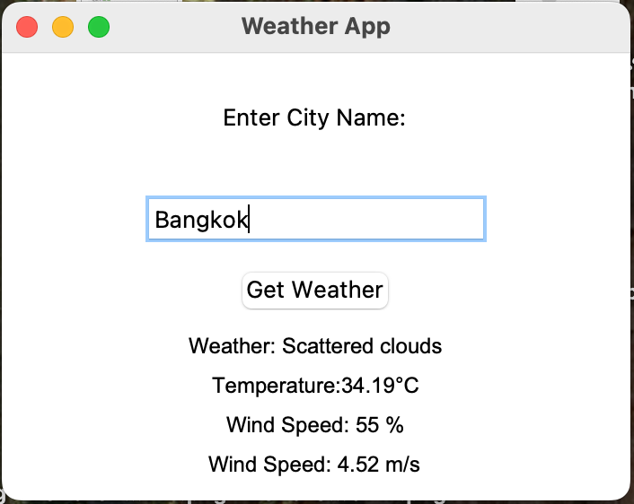

# Weather App ☀️☂️

A simple **Python-based Weather App** that demonstrates:

- **Working with APIs** (fetching real-time weather data from OpenWeather API)
- **Handling JSON files and HTTP requests**
- **Basic GUI development** using `tkinter`
- **Creating a functional application** that interacts with users

## Features

✅ Fetches real-time weather data for any city ✅ Displays temperature, weather conditions, humidity, and wind speed ✅ Simple and user-friendly **GUI** using `tkinter` ✅ Uses **OpenWeather API** for weather information

## Installation & Setup

### Prerequisites

Make sure you have **Python 3+** installed on your system. If you haven't installed it, download it from [python.org](https://www.python.org/downloads/).

### Steps to Run the Project

1. **Clone the Repository**

   ```sh
   git clone https://github.com/yourusername/weather-app.git
   cd weather-app
   ```

2. **Install Required Dependencies** The script requires the `requests` library to fetch weather data. Install it using:

   ```sh
   pip install requests
   ```

3. **Run the Application**

   ```sh
   python weather_app.py
   ```

## How It Works

1. Enter the name of the city in the input box.
2. Click the **"Get Weather"** button.
3. The app fetches the weather details via the **OpenWeather API** and displays:
   - Temperature (**°C**)
   - Weather Condition (**Clear, Rainy, Cloudy, etc.**)
   - Humidity (% Relative Humidity)
   - Wind Speed (m/s)
4. If the city is **not found**, an error message is displayed.

## Screenshots



## API Key Setup

The application uses an **API key** from OpenWeather. Make sure to **replace** the API key in the script with your own:

```python
API_KEY = "your_openweather_api_key"
```

You can get an API key by signing up on [OpenWeather's website](https://home.openweathermap.org/users/sign_up).

## Contributing

Want to improve this project? Feel free to **fork** the repository and submit a **pull request**! 🚀

## License

This project is licensed under the **MIT License**.

---

### **Happy Coding! 🚀**

